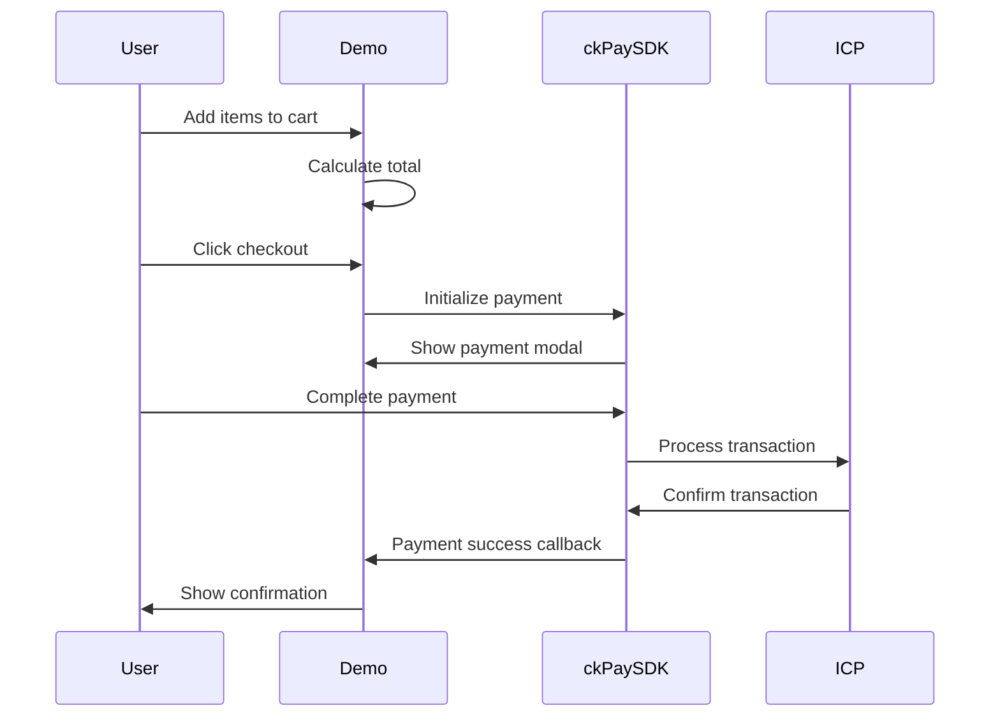

# Design Document

## Overview

The ckPayment E-Commerce Demo is a comprehensive React component that demonstrates a complete shopping cart and checkout flow using the ckPayment SDK. This component serves as both a functional demo and a reference implementation that developers can fork and customize for their own e-commerce applications. The design emphasizes simplicity, clarity, and real-world applicability while showcasing the key features of ckPayment integration.

## Architecture

### Component Structure

```
CkPaymentEcommerceDemo/
├── components/
│   ├── ShoppingCart.tsx          # Cart display and management
│   ├── ProductList.tsx           # Product catalog display
│   ├── CheckoutButton.tsx        # Payment initiation
│   ├── PaymentModal.tsx          # ckPayment integration wrapper
│   └── PaymentStatus.tsx         # Success/error feedback
├── hooks/
│   ├── useCart.ts               # Cart state management
│   ├── useCkPayment.ts          # ckPayment SDK integration
│   └── usePaymentStatus.ts      # Payment flow state
├── types/
│   └── ecommerce.ts             # TypeScript interfaces
└── utils/
    └── ckPaymentHelpers.ts      # SDK utility functions
```

### State Management Architecture

The demo uses React's built-in state management with custom hooks to handle:

1. **Cart State**: Product quantities, totals, and cart operations
2. **Payment State**: Payment flow status, loading states, and results
3. **SDK State**: ckPayment SDK initialization and configuration

### Integration Flow



## Components and Interfaces

### Core Components

#### 1. CkPaymentEcommerceDemo (Main Component)

**Purpose**: Root component that orchestrates the entire demo experience

**Props**:
```typescript
interface CkPaymentEcommerceDemoProps {
  theme?: 'light' | 'dark';
  canisterId?: string;
  testMode?: boolean;
}
```

**Key Features**:
- Responsive layout with Tailwind CSS
- Dark/light theme support
- Test mode for development
- Error boundary integration

#### 2. ProductList Component

**Purpose**: Displays available products with add/remove functionality

**Interface**:
```typescript
interface Product {
  id: string;
  name: string;
  price: number; // in ckBTC
  description: string;
  image?: string;
}

interface ProductListProps {
  products: Product[];
  onAddToCart: (productId: string) => void;
  cartItems: CartItem[];
}
```

**Sample Products**:
- Premium T-Shirt: 0.5 ckBTC
- Designer Hat: 0.3 ckBTC  
- Digital Course: 0.8 ckBTC

#### 3. ShoppingCart Component

**Purpose**: Displays cart contents with quantity controls and total calculation

**Interface**:
```typescript
interface CartItem {
  productId: string;
  product: Product;
  quantity: number;
}

interface ShoppingCartProps {
  items: CartItem[];
  onUpdateQuantity: (productId: string, quantity: number) => void;
  onRemoveItem: (productId: string) => void;
  total: number;
}
```

#### 4. CheckoutButton Component

**Purpose**: Initiates the ckPayment flow

**Interface**:
```typescript
interface CheckoutButtonProps {
  total: number;
  disabled: boolean;
  onCheckout: () => void;
  loading: boolean;
}
```

#### 5. PaymentModal Component

**Purpose**: Wraps ckPayment SDK integration

**Interface**:
```typescript
interface PaymentModalProps {
  isOpen: boolean;
  amount: number;
  onSuccess: (transactionId: string) => void;
  onError: (error: string) => void;
  onClose: () => void;
}
```

### Custom Hooks

#### useCart Hook

**Purpose**: Manages shopping cart state and operations

```typescript
interface UseCartReturn {
  items: CartItem[];
  total: number;
  itemCount: number;
  addItem: (product: Product) => void;
  removeItem: (productId: string) => void;
  updateQuantity: (productId: string, quantity: number) => void;
  clearCart: () => void;
}
```

#### useCkPayment Hook

**Purpose**: Handles ckPayment SDK integration and lifecycle

```typescript
interface UseCkPaymentReturn {
  isLoaded: boolean;
  isInitialized: boolean;
  error: string | null;
  initializePayment: (amount: number) => Promise<void>;
  processPayment: (config: PaymentConfig) => Promise<PaymentResult>;
}
```

## Data Models

### Product Model

```typescript
interface Product {
  id: string;
  name: string;
  price: number; // ckBTC amount
  description: string;
  image?: string;
  category?: string;
  inStock: boolean;
}
```

### Cart Models

```typescript
interface CartItem {
  productId: string;
  product: Product;
  quantity: number;
  subtotal: number; // calculated field
}

interface CartSummary {
  items: CartItem[];
  subtotal: number;
  total: number; // same as subtotal for demo simplicity
  itemCount: number;
}
```

### Payment Models

```typescript
interface PaymentConfig {
  amount: number;
  currency: 'ckBTC';
  canisterId?: string;
  metadata?: {
    orderId: string;
    items: CartItem[];
  };
}

interface PaymentResult {
  success: boolean;
  transactionId?: string;
  error?: string;
  timestamp: number;
}
```

## Error Handling

### Error Categories

1. **SDK Loading Errors**: ckPayment script fails to load
2. **Initialization Errors**: SDK fails to initialize
3. **Payment Errors**: Transaction failures or user cancellation
4. **Network Errors**: Connection issues during payment

### Error Handling Strategy

```typescript
interface ErrorState {
  type: 'sdk' | 'payment' | 'network' | 'validation';
  message: string;
  recoverable: boolean;
  retryAction?: () => void;
}
```

### User-Friendly Error Messages

- **SDK Load Failure**: "Payment system unavailable. Please refresh and try again."
- **Payment Failure**: "Payment could not be processed. Please try again or contact support."
- **Network Issues**: "Connection lost. Please check your internet and retry."

## Testing Strategy

### Unit Tests

1. **Cart Operations**: Add, remove, update quantity, calculate totals
2. **Payment Flow**: SDK initialization, payment processing, callbacks
3. **Error Handling**: Various failure scenarios and recovery
4. **Utility Functions**: Price calculations, formatting, validation

### Integration Tests

1. **Complete Purchase Flow**: End-to-end shopping and payment
2. **SDK Integration**: Real ckPayment SDK interaction (test mode)
3. **Responsive Behavior**: Mobile and desktop layouts
4. **Error Recovery**: User actions after errors

### Test Data

```typescript
const mockProducts: Product[] = [
  {
    id: 'tshirt-001',
    name: 'Premium T-Shirt',
    price: 0.5,
    description: 'High-quality cotton t-shirt with modern design',
    inStock: true
  },
  {
    id: 'hat-001', 
    name: 'Designer Hat',
    price: 0.3,
    description: 'Stylish hat perfect for any occasion',
    inStock: true
  },
  {
    id: 'course-001',
    name: 'Digital Course',
    price: 0.8,
    description: 'Complete guide to blockchain development',
    inStock: true
  }
];
```

## User Experience Design

### Visual Design Principles

1. **Clean and Minimal**: Focus on functionality over decoration
2. **Consistent Branding**: Use ckPayment brand colors (blue/cyan palette)
3. **Clear Hierarchy**: Obvious flow from products → cart → checkout
4. **Responsive First**: Mobile-optimized with desktop enhancements

### Interaction Design

1. **Progressive Disclosure**: Show payment details only when needed
2. **Immediate Feedback**: Loading states, success animations, error alerts
3. **Accessibility**: Keyboard navigation, screen reader support, ARIA labels
4. **Performance**: Lazy loading, optimized images, minimal bundle size

### Layout Structure

```
┌─────────────────────────────────────┐
│ Header: ckPayment E-Commerce Demo   │
├─────────────────────────────────────┤
│ Product Grid                        │
│ ┌─────┐ ┌─────┐ ┌─────┐            │
│ │ T-  │ │ Hat │ │Course│            │
│ │Shirt│ │     │ │     │            │
│ └─────┘ └─────┘ └─────┘            │
├─────────────────────────────────────┤
│ Shopping Cart                       │
│ • T-Shirt x2 - 1.0 ckBTC          │
│ • Hat x1 - 0.3 ckBTC              │
│ Total: 1.3 ckBTC                   │
│ [Checkout with ckPayment]          │
├─────────────────────────────────────┤
│ Footer: Fork on GitHub             │
└─────────────────────────────────────┘
```

## Technical Implementation Details

### ckPayment SDK Integration

#### Script Loading

```typescript
const loadCkPaymentSDK = (): Promise<void> => {
  return new Promise((resolve, reject) => {
    if (window.ckPaySDK) {
      resolve();
      return;
    }

    const script = document.createElement('script');
    script.src = 'https://zkg6o-xiaaa-aaaag-acofa-cai.icp0.io/ckPay.js';
    script.async = true;
    script.onload = () => resolve();
    script.onerror = () => reject(new Error('Failed to load ckPayment SDK'));
    document.head.appendChild(script);
  });
};
```

#### Payment Modal Integration

```typescript
const initializePayment = async (amount: number) => {
  // Create modal container
  const modalDiv = document.createElement('div');
  modalDiv.id = 'ckpayment-modal';
  document.body.appendChild(modalDiv);

  // Initialize ckPayment component
  window.ckPaySDK.PaymentComponent.initialize('ckpayment-modal');
  
  // Configure payment
  const paymentConfig = {
    amount,
    currency: 'ckBTC',
    canisterId: process.env.REACT_APP_CANISTER_ID || 'placeholder-canister-id',
    onSuccess: handlePaymentSuccess,
    onError: handlePaymentError
  };

  // Render payment modal
  window.ckPaySDK.PaymentComponent.renderPaymentModal(paymentConfig);
};
```

### State Management Patterns

#### Cart State with useReducer

```typescript
type CartAction = 
  | { type: 'ADD_ITEM'; product: Product }
  | { type: 'REMOVE_ITEM'; productId: string }
  | { type: 'UPDATE_QUANTITY'; productId: string; quantity: number }
  | { type: 'CLEAR_CART' };

const cartReducer = (state: CartState, action: CartAction): CartState => {
  switch (action.type) {
    case 'ADD_ITEM':
      // Implementation details...
    case 'REMOVE_ITEM':
      // Implementation details...
    // ... other cases
  }
};
```

### Performance Optimizations

1. **Memoization**: React.memo for product components
2. **Lazy Loading**: Dynamic imports for payment modal
3. **Bundle Splitting**: Separate chunks for SDK integration
4. **Image Optimization**: WebP format with fallbacks

### Accessibility Features

1. **ARIA Labels**: Descriptive labels for all interactive elements
2. **Keyboard Navigation**: Tab order and keyboard shortcuts
3. **Screen Reader Support**: Semantic HTML and ARIA attributes
4. **Color Contrast**: WCAG AA compliant color combinations
5. **Focus Management**: Clear focus indicators and logical flow

### CodeSandbox Compatibility

The demo is structured to work seamlessly in CodeSandbox with:

1. **Single File Option**: All code in one component for simple forking
2. **Modular Option**: Separate files for advanced customization
3. **Environment Variables**: Easy configuration for different environments
4. **Package Dependencies**: Minimal external dependencies
5. **Build Configuration**: Works with standard React build tools