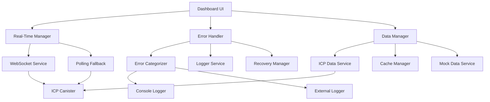
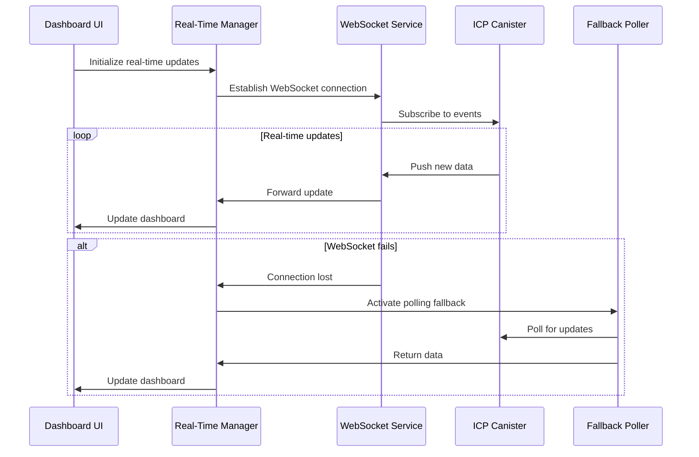

# Design Document

## Overview

This design document outlines the technical implementation for enhancing the ICP Developer Dashboard with blockchain-specific features, real-time capabilities, and robust error handling. The design focuses on maintaining backward compatibility while adding powerful new features for ICP developers.

## Architecture

### High-Level Architecture



### Real-Time Data Flow



## Components and Interfaces

### 1. Enhanced Data Models

#### ICP-Specific Transaction Model
```typescript
interface ICPTransactionData extends TransactionData {
  // ICP-specific fields
  cycleCost: bigint;
  subnetId: string;
  canisterId: string;
  methodName?: string;
  
  // Inter-canister call information
  callHierarchy?: {
    caller: string;
    callee: string;
    method: string;
    cycleCost: bigint;
  }[];
  
  // Performance metrics
  executionTime: number; // microseconds
  memoryUsage: number; // bytes
  instructionCount: bigint;
  
  // Subnet information
  subnetMetrics: {
    uptime: number; // percentage
    responseTime: number; // milliseconds
    throughput: number; // transactions per second
  };
  
  // Consensus information
  consensusRound?: bigint;
  blockHeight?: bigint;
  certificateHash?: string;
}
```

#### Enhanced Metrics Model
```typescript
interface ICPMetricsData extends MetricsData {
  // Cycle-related metrics
  cycleMetrics: {
    totalCyclesUsed: bigint;
    averageCyclePerTransaction: bigint;
    cycleEfficiency: number; // cycles per instruction
    cyclesBurned: bigint;
    cyclesRefunded: bigint;
  };
  
  // Subnet performance
  subnetMetrics: {
    [subnetId: string]: {
      uptime: number;
      averageResponseTime: number;
      throughput: number;
      errorRate: number;
      lastUpdated: string;
    };
  };
  
  // Canister health
  canisterHealth: {
    memoryUsage: number;
    cycleBalance: bigint;
    freezingThreshold: bigint;
    status: 'running' | 'stopping' | 'stopped';
    controllers: string[];
  };
  
  // Performance trends
  performanceTrends: {
    cycleUsageTrend: number; // percentage change
    throughputTrend: number;
    errorRateTrend: number;
    responseTimeTrend: number;
  };
}
```

### 2. Real-Time Update System

#### WebSocket Manager
```typescript
interface WebSocketManager {
  // Connection management
  connect(canisterId: string): Promise<void>;
  disconnect(): void;
  reconnect(): Promise<void>;
  
  // Subscription management
  subscribe(eventType: string, callback: (data: any) => void): string;
  unsubscribe(subscriptionId: string): void;
  
  // Connection status
  getConnectionStatus(): 'connected' | 'connecting' | 'disconnected' | 'error';
  getConnectionQuality(): 'excellent' | 'good' | 'poor' | 'unstable';
  
  // Configuration
  setHeartbeatInterval(interval: number): void;
  setReconnectStrategy(strategy: ReconnectStrategy): void;
}

interface ReconnectStrategy {
  maxAttempts: number;
  initialDelay: number;
  maxDelay: number;
  backoffMultiplier: number;
}
```

#### Real-Time Data Manager
```typescript
interface RealTimeDataManager {
  // Update management
  startRealTimeUpdates(config: RealTimeConfig): void;
  stopRealTimeUpdates(): void;
  pauseUpdates(): void;
  resumeUpdates(): void;
  
  // Data streaming
  onMetricsUpdate(callback: (metrics: ICPMetricsData) => void): void;
  onTransactionUpdate(callback: (transaction: ICPTransactionData) => void): void;
  onErrorUpdate(callback: (error: DashboardError) => void): void;
  
  // Fallback management
  enablePollingFallback(enabled: boolean): void;
  setPollingInterval(interval: number): void;
  
  // Performance optimization
  setUpdateThrottling(enabled: boolean, interval: number): void;
  setBandwidthOptimization(enabled: boolean): void;
}

interface RealTimeConfig {
  enableWebSocket: boolean;
  enablePollingFallback: boolean;
  heartbeatInterval: number;
  maxReconnectAttempts: number;
  updateThrottling: {
    enabled: boolean;
    interval: number;
  };
  bandwidthOptimization: boolean;
}
```

### 3. Enhanced Error Handling System

#### Error Categories and Types
```typescript
// Enhanced error types
type DashboardErrorType = 
  | 'network'
  | 'canister'
  | 'validation'
  | 'authentication'
  | 'authorization'
  | 'rate_limit'
  | 'websocket'
  | 'consensus'
  | 'subnet'
  | 'cycles'
  | 'memory'
  | 'unknown';

interface EnhancedDashboardError extends DashboardError {
  type: DashboardErrorType;
  severity: 'low' | 'medium' | 'high' | 'critical';
  category: 'user' | 'system' | 'network' | 'blockchain';
  
  // ICP-specific error details
  canisterError?: {
    code: number;
    message: string;
    canisterId: string;
    methodName?: string;
  };
  
  // Network error details
  networkError?: {
    statusCode?: number;
    timeout: boolean;
    retryable: boolean;
    endpoint: string;
  };
  
  // Context information
  context: {
    userId?: string;
    sessionId: string;
    canisterId?: string;
    subnetId?: string;
    timestamp: string;
    userAgent: string;
    url: string;
    stackTrace?: string;
  };
  
  // Recovery information
  recovery: {
    suggested: boolean;
    actions: RecoveryAction[];
    autoRetry: boolean;
    retryCount: number;
    maxRetries: number;
  };
}

interface RecoveryAction {
  type: 'retry' | 'refresh' | 'reconnect' | 'fallback' | 'contact_support';
  label: string;
  description: string;
  action: () => Promise<void>;
  priority: number;
}
```

#### Error Handler Service
```typescript
interface ErrorHandlerService {
  // Error processing
  handleError(error: Error, context: ErrorContext): EnhancedDashboardError;
  categorizeError(error: Error): DashboardErrorType;
  determineSeverity(error: EnhancedDashboardError): 'low' | 'medium' | 'high' | 'critical';
  
  // Logging
  logError(error: EnhancedDashboardError): void;
  logToConsole(error: EnhancedDashboardError): void;
  logToExternal(error: EnhancedDashboardError): Promise<void>;
  
  // Recovery
  suggestRecovery(error: EnhancedDashboardError): RecoveryAction[];
  executeRecovery(action: RecoveryAction): Promise<boolean>;
  
  // Circuit breaker
  shouldCircuitBreak(errorType: DashboardErrorType): boolean;
  resetCircuitBreaker(errorType: DashboardErrorType): void;
  
  // Error analytics
  getErrorStats(): ErrorStats;
  getErrorTrends(): ErrorTrend[];
}

interface ErrorContext {
  component: string;
  operation: string;
  userId?: string;
  canisterId?: string;
  additionalData?: Record<string, any>;
}
```

### 4. Advanced Analytics Engine

#### Metrics Calculator
```typescript
interface MetricsCalculator {
  // Cycle analytics
  calculateCycleEfficiency(transactions: ICPTransactionData[]): number;
  calculateCycleTrends(timeRange: TimeRange): CycleTrend[];
  calculateCostPerOperation(transactions: ICPTransactionData[]): Map<string, bigint>;
  
  // Performance analytics
  calculateThroughput(transactions: ICPTransactionData[], subnetId?: string): number;
  calculateResponseTimePercentiles(transactions: ICPTransactionData[]): ResponseTimePercentiles;
  calculateSubnetHealth(subnetId: string): SubnetHealthScore;
  
  // Predictive analytics
  predictCycleUsage(historicalData: ICPMetricsData[], timeframe: number): CyclePrediction;
  detectAnomalies(metrics: ICPMetricsData[]): Anomaly[];
  
  // Comparative analytics
  comparePerformance(period1: TimeRange, period2: TimeRange): PerformanceComparison;
  benchmarkAgainstNetwork(canisterId: string): BenchmarkResult;
}

interface CycleTrend {
  timestamp: string;
  totalCycles: bigint;
  averageCycles: bigint;
  efficiency: number;
  cost: number; // in USD equivalent
}

interface SubnetHealthScore {
  overall: number; // 0-100
  uptime: number;
  performance: number;
  reliability: number;
  factors: {
    responseTime: number;
    throughput: number;
    errorRate: number;
    consensusHealth: number;
  };
}
```

### 5. User Interface Enhancements

#### Real-Time UI Components
```typescript
interface RealTimeIndicator {
  status: 'live' | 'delayed' | 'offline';
  lastUpdate: Date;
  updateFrequency: number;
  connectionQuality: 'excellent' | 'good' | 'poor';
}

interface AnimatedMetricCard extends MetricsCard {
  // Animation configuration
  animateOnUpdate: boolean;
  animationType: 'pulse' | 'glow' | 'bounce' | 'slide';
  animationDuration: number;
  
  // Real-time features
  showRealTimeIndicator: boolean;
  highlightChanges: boolean;
  showTrend: boolean;
  
  // Alert configuration
  alertThresholds: {
    warning: number;
    critical: number;
  };
  alertActions: AlertAction[];
}

interface NotificationSystem {
  // Notification management
  showNotification(notification: DashboardNotification): string;
  hideNotification(id: string): void;
  clearAllNotifications(): void;
  
  // Notification types
  showSuccess(message: string, options?: NotificationOptions): void;
  showWarning(message: string, options?: NotificationOptions): void;
  showError(error: EnhancedDashboardError, options?: NotificationOptions): void;
  showInfo(message: string, options?: NotificationOptions): void;
  
  // Configuration
  setGlobalOptions(options: GlobalNotificationOptions): void;
  enableSounds(enabled: boolean): void;
  setPosition(position: NotificationPosition): void;
}
```

## Data Models

### Enhanced Type Definitions

```typescript
// Time-based data structures
interface TimeRange {
  start: Date;
  end: Date;
  granularity: 'minute' | 'hour' | 'day' | 'week' | 'month';
}

// Performance monitoring
interface PerformanceMetrics {
  responseTime: {
    p50: number;
    p90: number;
    p95: number;
    p99: number;
  };
  throughput: {
    current: number;
    average: number;
    peak: number;
  };
  errorRate: {
    current: number;
    average: number;
    byType: Map<string, number>;
  };
}

// Real-time update payloads
interface RealTimeUpdate {
  type: 'metrics' | 'transaction' | 'error' | 'status';
  timestamp: string;
  data: any;
  metadata: {
    source: string;
    version: string;
    checksum?: string;
  };
}

// Configuration models
interface DashboardConfiguration {
  realTime: RealTimeConfig;
  notifications: NotificationConfig;
  analytics: AnalyticsConfig;
  display: DisplayConfig;
  performance: PerformanceConfig;
}

interface AnalyticsConfig {
  enablePredictiveAnalytics: boolean;
  enableAnomalyDetection: boolean;
  retentionPeriod: number; // days
  aggregationLevels: ('minute' | 'hour' | 'day')[];
  customMetrics: CustomMetric[];
}
```

## Error Handling

### Error Recovery Strategies

1. **Network Errors**
   - Automatic retry with exponential backoff
   - Fallback to cached data
   - Switch to polling mode
   - Display offline indicator

2. **Canister Errors**
   - Parse and display specific error codes
   - Suggest corrective actions
   - Log for debugging
   - Provide documentation links

3. **WebSocket Errors**
   - Automatic reconnection
   - Fallback to HTTP polling
   - Connection quality monitoring
   - Bandwidth optimization

4. **Data Validation Errors**
   - Client-side validation
   - Sanitization and correction
   - User feedback
   - Graceful degradation

### Circuit Breaker Implementation

```typescript
interface CircuitBreaker {
  state: 'closed' | 'open' | 'half-open';
  failureCount: number;
  failureThreshold: number;
  timeout: number;
  lastFailureTime: Date;
  
  execute<T>(operation: () => Promise<T>): Promise<T>;
  reset(): void;
  forceOpen(): void;
  getState(): CircuitBreakerState;
}
```

## Testing Strategy

### Unit Testing
- Component isolation testing
- Mock data service testing
- Error handler testing
- Real-time manager testing
- Metrics calculator testing

### Integration Testing
- WebSocket connection testing
- ICP canister integration
- Error recovery scenarios
- Performance under load
- Cross-browser compatibility

### End-to-End Testing
- Complete user workflows
- Real-time update scenarios
- Error handling flows
- Performance benchmarks
- Accessibility compliance

### Performance Testing
- WebSocket connection limits
- Memory usage monitoring
- CPU usage optimization
- Network bandwidth efficiency
- Large dataset handling

## Security Considerations

### Data Protection
- Sensitive data encryption
- Secure WebSocket connections (WSS)
- API key protection
- User session management
- CORS configuration

### Error Information
- Sanitize error messages
- Avoid exposing internal details
- Log security events
- Rate limiting for error endpoints
- Input validation and sanitization

## Deployment Strategy

### Phased Rollout
1. **Phase 1**: Enhanced data models and error handling
2. **Phase 2**: Real-time WebSocket implementation
3. **Phase 3**: Advanced analytics and UI enhancements
4. **Phase 4**: Performance optimization and monitoring

### Feature Flags
- Real-time updates toggle
- Advanced analytics toggle
- Enhanced error logging toggle
- Performance monitoring toggle
- Beta features toggle

### Monitoring and Observability
- Real-time connection monitoring
- Error rate tracking
- Performance metrics collection
- User experience analytics
- System health dashboards