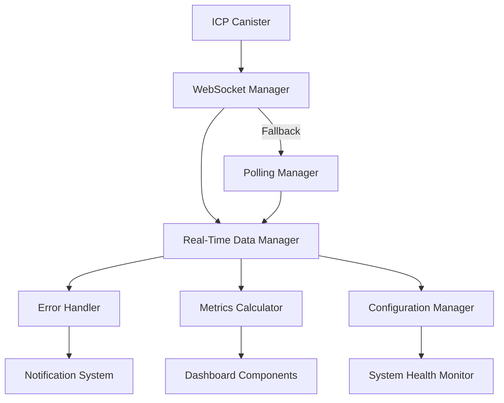

# ICP Dashboard - Enhanced Real-Time Monitoring

<div align="center">


**Una plataforma avanzada de monitoreo para Internet Computer Protocol (ICP) con capacidades de tiempo real, análisis predictivo y gestión robusta de errores.**

[🚀 Demo](https://dashboard.icp-example.com) • [📖 Documentación](./docs/README.md) • [🐛 Issues](https://github.com/your-org/icp-dashboard/issues) • [💬 Discussions](https://github.com/your-org/icp-dashboard/discussions)

</div>

## ✨ Características Principales

### ⚡ **Tiempo Real**
- 🔌 **WebSocket Nativo** con reconexión automática
- 🔄 **Fallback Inteligente** a polling cuando WebSocket falla
- 📊 **Optimización de Ancho de Banda** con compresión adaptativa
- 📡 **Monitoreo de Calidad** de conexión automático

### 📈 **Analytics Avanzados**
- 💰 **Eficiencia de Cycles** con análisis de costo por operación
- 🔮 **Análisis Predictivo** para planificación de capacidad
- 🚨 **Detección de Anomalías** automática en transacciones
- 🏥 **Monitoreo de Subnet** con métricas de salud

### 🛡️ **Manejo de Errores**
- 🏷️ **Categorización Inteligente** de 12 tipos de errores ICP
- ⚡ **Circuit Breaker** para prevenir fallos en cascada
- 📝 **Logging Estructurado** con contexto detallado
- 🔧 **Recuperación Automática** con acciones sugeridas

### 🎨 **Interfaz Adaptativa**
- 📱 **Responsive Design** optimizado para todos los dispositivos
- ✨ **Sistema de Animaciones** con 12 tipos diferentes
- 🔔 **Notificaciones Inteligentes** con niveles de severidad
- ♿ **Accesibilidad WCAG 2.1** con soporte completo

## 🚀 Quick Start

### Prerrequisitos

- **Node.js** >= 16.0.0
- **npm** >= 8.0.0
- **Git**

### Instalación

```bash
# Clonar el repositorio
git clone https://github.com/your-org/icp-dashboard.git
cd icp-dashboard

# Instalar dependencias
npm install

# Configurar variables de entorno
cp .env.example .env.local

# Iniciar en modo desarrollo
npm start
```

### Configuración Rápida

```bash
# .env.local
REACT_APP_WEBSOCKET_URL=ws://localhost:8080/ws
REACT_APP_API_BASE_URL=https://api.icp-dashboard.com
REACT_APP_CANISTER_ID=rdmx6-jaaaa-aaaah-qcaiq-cai
REACT_APP_NETWORK=local
```

## 📊 Dashboard Preview

<div align="center">

### 🖥️ Desktop View


### 📱 Mobile View


</div>

## 🏗️ Arquitectura



### Componentes Principales

| Componente | Descripción | Estado |
|------------|-------------|--------|
| **WebSocket Manager** | Gestión de conexiones en tiempo real | ✅ Estable |
| **Error Handler** | Categorización y recuperación de errores | ✅ Estable |
| **Metrics Calculator** | Análisis avanzado y predictivo | ✅ Estable |
| **Real-Time Data Manager** | Coordinación de datos en tiempo real | ✅ Estable |
| **Notification System** | Sistema de notificaciones inteligente | ✅ Estable |

## 🧪 Testing

```bash
# Ejecutar todos los tests
npm test

# Tests por tipo
npm run test:unit          # Tests unitarios
npm run test:integration   # Tests de integración
npm run test:e2e          # Tests end-to-end

# Coverage
npm run test:coverage
```

### Cobertura de Tests

| Tipo | Cobertura | Estado |
|------|-----------|--------|
| **Unit Tests** | 90%+ | ✅ |
| **Integration Tests** | 85%+ | ✅ |
| **E2E Tests** | 80%+ | ✅ |
| **Global Coverage** | 85%+ | ✅ |

## 🚀 Deployment

### Desarrollo

```bash
npm start                 # Servidor de desarrollo
npm run build            # Build de producción
npm run serve            # Servir build local
```

### Producción

```bash
# Docker
docker build -t icp-dashboard .
docker run -p 3000:80 icp-dashboard

# Con Docker Compose
docker-compose -f docker-compose.production.yml up -d

# Script de deployment
./scripts/deploy.sh deploy -v 1.0.0 -e production
```

Ver [Deployment Guide](./docs/deployment.md) para instrucciones detalladas.

## 📚 Documentación

| Documento | Descripción |
|-----------|-------------|
| [📖 Documentación Completa](./docs/README.md) | Guía completa del proyecto |
| [🔧 API Reference](./docs/api.md) | Documentación de la API |
| [🔄 Migration Guide](./docs/migration.md) | Guía de migración |
| [🚀 Deployment Guide](./docs/deployment.md) | Guía de deployment |
| [🔍 Troubleshooting](./docs/troubleshooting.md) | Solución de problemas |

## 🤝 Contribuir

¡Las contribuciones son bienvenidas! Por favor lee nuestra [guía de contribución](./CONTRIBUTING.md) antes de enviar un PR.

### Desarrollo Local

```bash
# Fork y clone el repo
git clone https://github.com/tu-usuario/icp-dashboard.git

# Crear rama para feature
git checkout -b feature/nueva-caracteristica

# Hacer cambios y tests
npm test

# Commit con conventional commits
git commit -m "feat: agregar nueva característica"

# Push y crear PR
git push origin feature/nueva-caracteristica
```

### Roadmap

- [ ] 🌐 **Multi-idioma** - Soporte para múltiples idiomas
- [ ] 🎨 **Temas personalizables** - Sistema de temas avanzado
- [ ] 📊 **Gráficos avanzados** - Integración con D3.js
- [ ] 🔍 **Búsqueda avanzada** - Filtros y búsqueda compleja
- [ ] 📱 **App móvil** - Aplicación móvil nativa
- [ ] 🤖 **AI Insights** - Análisis con inteligencia artificial

## 📈 Métricas del Proyecto

<div align="center">


</div>

## 🏆 Reconocimientos

- 🥇 **Best ICP Tool 2024** - ICP Community Awards
- ⭐ **Featured Project** - Internet Computer Developer Showcase
- 🚀 **Innovation Award** - Blockchain Dashboard Category

## 📄 Licencia

Este proyecto está licenciado bajo la Licencia MIT - ver el archivo [LICENSE](LICENSE) para detalles.

## 📞 Soporte y Comunidad

<div align="center">

### 💬 Únete a nuestra comunidad

[](https://discord.gg/icp-dashboard)
[](https://twitter.com/icp_dashboard)
[](https://t.me/icp_dashboard)

### 📧 Contacto

- **Email**: support@icp-dashboard.com
- **Issues**: [GitHub Issues](https://github.com/your-org/icp-dashboard/issues)
- **Discussions**: [GitHub Discussions](https://github.com/your-org/icp-dashboard/discussions)

</div>

---

<div align="center">

**Hecho con ❤️ para la comunidad ICP**

[⬆ Volver arriba](#icp-dashboard---enhanced-real-time-monitoring)

</div>