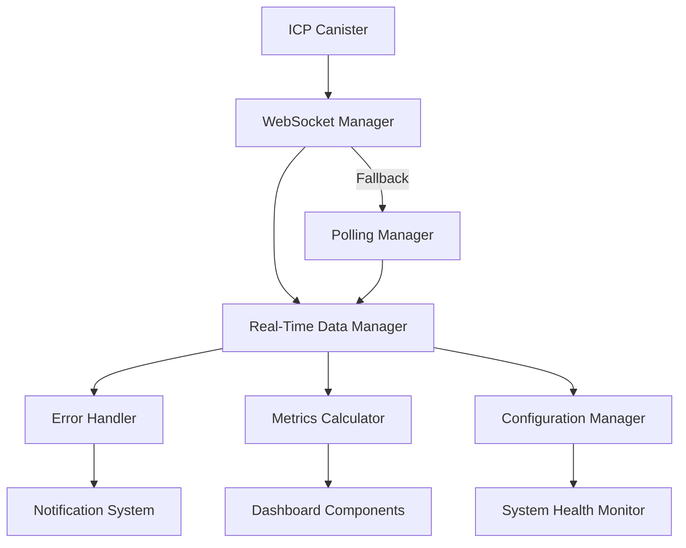

# ICP Dashboard - Enhanced Real-Time Monitoring

Una plataforma avanzada de monitoreo para Internet Computer Protocol (ICP) con capacidades de tiempo real, análisis predictivo y gestión robusta de errores.

## 🚀 Características Principales

### ⚡ **Tiempo Real**
- **WebSocket Nativo**: Conexiones bidireccionales para actualizaciones instantáneas
- **Fallback Inteligente**: Transición automática a polling cuando WebSocket falla
- **Optimización de Ancho de Banda**: Compresión de datos y throttling adaptativo
- **Calidad de Conexión**: Monitoreo automático y ajuste de frecuencia de actualizaciones

### 📊 **Analytics Avanzados**
- **Eficiencia de Cycles**: Cálculos de costo por operación y optimización
- **Análisis Predictivo**: Forecasting de uso de cycles y planificación de capacidad
- **Detección de Anomalías**: Identificación automática de patrones inusuales
- **Métricas de Subnet**: Monitoreo de salud y rendimiento por subnet

### 🛡️ **Manejo de Errores**
- **Categorización Inteligente**: 12 tipos de errores específicos de ICP
- **Circuit Breaker**: Prevención de fallos en cascada
- **Recuperación Automática**: Acciones de recuperación sugeridas y automatizadas
- **Logging Estructurado**: Contexto detallado para debugging

### 🎨 **Interfaz Adaptativa**
- **Responsive Design**: Optimizado para desktop, tablet y móvil
- **Animaciones Inteligentes**: Sistema de animaciones con 12 tipos diferentes
- **Accesibilidad WCAG 2.1**: Cumplimiento AA con soporte para lectores de pantalla
- **Temas Personalizables**: Modo alto contraste y reducción de movimiento

### ⚙️ **Configuración Avanzada**
- **Gestión de Configuración**: Sistema completo con validación y backup
- **Monitoreo de Sistema**: Métricas de rendimiento y salud del sistema
- **Optimización Móvil**: Adaptación automática para conexiones limitadas
- **Feature Flags**: Despliegue gradual de nuevas características

## 📋 Tabla de Contenidos

- [Instalación](#instalación)
- [Configuración](#configuración)
- [Arquitectura](#arquitectura)
- [API Reference](#api-reference)
- [Guías de Desarrollo](#guías-de-desarrollo)
- [Testing](#testing)
- [Deployment](#deployment)
- [Troubleshooting](#troubleshooting)
- [Contributing](#contributing)

## 🛠️ Instalación

### Prerrequisitos

- **Node.js**: >= 16.0.0
- **npm**: >= 8.0.0
- **TypeScript**: >= 4.9.0

### Instalación Rápida

```bash
# Clonar el repositorio
git clone https://github.com/your-org/icp-dashboard.git
cd icp-dashboard

# Instalar dependencias
npm install

# Configurar variables de entorno
cp .env.example .env.local

# Iniciar en modo desarrollo
npm start
```

### Instalación para Producción

```bash
# Instalar dependencias de producción
npm ci --only=production

# Construir la aplicación
npm run build

# Servir archivos estáticos
npm run serve
```

## ⚙️ Configuración

### Variables de Entorno

```bash
# .env.local
REACT_APP_WEBSOCKET_URL=ws://localhost:8080/ws
REACT_APP_API_BASE_URL=https://api.icp-dashboard.com
REACT_APP_CANISTER_ID=rdmx6-jaaaa-aaaah-qcaiq-cai
REACT_APP_NETWORK=local
REACT_APP_ENABLE_ANALYTICS=true
REACT_APP_LOG_LEVEL=info
```

### Configuración del Dashboard

```typescript
// src/config/dashboard.config.ts
export const dashboardConfig = {
  websocket: {
    url: process.env.REACT_APP_WEBSOCKET_URL,
    reconnectInterval: 5000,
    maxReconnectAttempts: 5,
  },
  polling: {
    interval: 30000,
    maxRetries: 3,
  },
  analytics: {
    enabled: process.env.REACT_APP_ENABLE_ANALYTICS === 'true',
    batchSize: 100,
    flushInterval: 10000,
  },
  ui: {
    theme: 'auto', // 'light' | 'dark' | 'auto'
    animations: true,
    reducedMotion: false,
  }
};
```

## 🏗️ Arquitectura

### Estructura del Proyecto

```
src/
├── components/           # Componentes React
│   ├── ui/              # Componentes de UI reutilizables
│   └── dashboard/       # Componentes específicos del dashboard
├── services/            # Servicios de negocio
│   ├── websocket-manager.ts
│   ├── error-handler.ts
│   ├── metrics-calculator.ts
│   └── realtime-data-manager.ts
├── hooks/               # Custom React hooks
├── types/               # Definiciones de TypeScript
├── utils/               # Utilidades generales
├── styles/              # Estilos globales y temas
└── tests/               # Suite de testing
    ├── unit/
    ├── integration/
    └── e2e/
```

### Flujo de Datos



### Componentes Principales

#### **WebSocket Manager**
- Gestión de conexiones WebSocket
- Reconexión automática con backoff exponencial
- Evaluación de calidad de conexión
- Sistema de suscripciones por evento

#### **Real-Time Data Manager**
- Coordinación entre WebSocket y polling
- Throttling inteligente de actualizaciones
- Optimización de ancho de banda
- Gestión de estado de conexión

#### **Error Handler**
- Categorización automática de errores
- Logging estructurado con contexto
- Sugerencias de recuperación
- Circuit breaker pattern

#### **Metrics Calculator**
- Cálculos de eficiencia de cycles
- Análisis de rendimiento por subnet
- Detección de anomalías
- Análisis predictivo

## 📚 Guías de Desarrollo

### Agregar Nuevas Métricas

1. **Definir el tipo de métrica**:
```typescript
// src/types/dashboard.ts
interface CustomMetric {
  id: string;
  name: string;
  value: number;
  unit: string;
  timestamp: Date;
}
```

2. **Implementar el cálculo**:
```typescript
// src/services/metrics-calculator.ts
export class MetricsCalculator {
  calculateCustomMetric(data: TransactionData[]): CustomMetric {
    // Implementar lógica de cálculo
    return {
      id: 'custom-metric',
      name: 'Custom Metric',
      value: calculatedValue,
      unit: 'units',
      timestamp: new Date()
    };
  }
}
```

3. **Agregar al dashboard**:
```typescript
// src/components/dashboard/MetricsGrid.tsx
const customMetric = metricsCalculator.calculateCustomMetric(transactions);
```

### Crear Nuevos Componentes

```typescript
// src/components/ui/CustomComponent.tsx
import React from 'react';
import { useRealTimeData } from '../hooks/useRealTimeData';

interface CustomComponentProps {
  title: string;
  data?: any[];
}

export const CustomComponent: React.FC<CustomComponentProps> = ({ 
  title, 
  data = [] 
}) => {
  const { isConnected, connectionMode } = useRealTimeData();

  return (
    <div className="custom-component">
      <h3>{title}</h3>
      <div className="connection-status">
        Status: {isConnected ? 'Connected' : 'Disconnected'} ({connectionMode})
      </div>
      {/* Renderizar datos */}
    </div>
  );
};
```

## 🧪 Testing

### Ejecutar Tests

```bash
# Todos los tests
npm test

# Tests unitarios
npm run test:unit

# Tests de integración
npm run test:integration

# Tests E2E
npm run test:e2e

# Coverage
npm run test:coverage
```

### Escribir Tests

```typescript
// src/tests/services/custom-service.test.ts
import { CustomService } from '../../services/custom-service';

describe('CustomService', () => {
  let service: CustomService;

  beforeEach(() => {
    service = new CustomService();
  });

  test('should process data correctly', () => {
    const input = { value: 100 };
    const result = service.processData(input);
    
    expect(result).toEqual({
      processed: true,
      value: 100
    });
  });
});
```

## 🚀 Deployment

Ver [Deployment Guide](./deployment.md) para instrucciones detalladas.

### Quick Deploy

```bash
# Build para producción
npm run build

# Deploy a Vercel
vercel --prod

# Deploy a Netlify
netlify deploy --prod --dir=build
```

## 🔧 Troubleshooting

### Problemas Comunes

#### WebSocket no conecta
```bash
# Verificar URL del WebSocket
echo $REACT_APP_WEBSOCKET_URL

# Verificar conectividad
curl -I $REACT_APP_WEBSOCKET_URL
```

#### Errores de CORS
```javascript
// Configurar proxy en package.json
"proxy": "http://localhost:8080"
```

#### Performance Issues
```bash
# Analizar bundle
npm run analyze

# Verificar memory leaks
npm run test:memory
```

## 📖 Recursos Adicionales

- [API Documentation](./api.md)
- [Deployment Guide](./deployment.md)
- [Migration Guide](./migration.md)
- [Performance Guide](./performance.md)
- [Security Guide](./security.md)
- [Contributing Guide](./contributing.md)

## 📄 Licencia

MIT License - ver [LICENSE](../LICENSE) para detalles.

## 🤝 Contribuir

¡Las contribuciones son bienvenidas! Ver [CONTRIBUTING.md](./contributing.md) para guidelines.

## 📞 Soporte

- **Issues**: [GitHub Issues](https://github.com/your-org/icp-dashboard/issues)
- **Discussions**: [GitHub Discussions](https://github.com/your-org/icp-dashboard/discussions)
- **Email**: support@icp-dashboard.com

---

**Versión**: 1.0.0  
**Última actualización**: Enero 2025